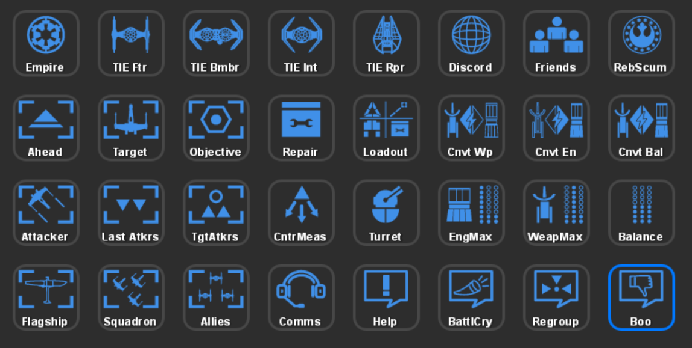
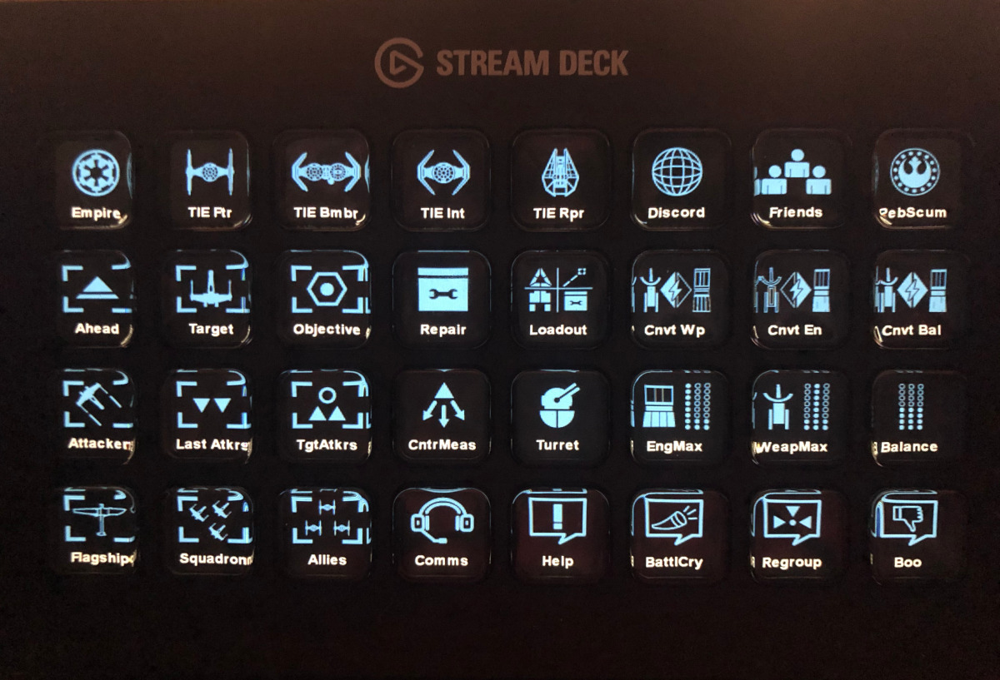
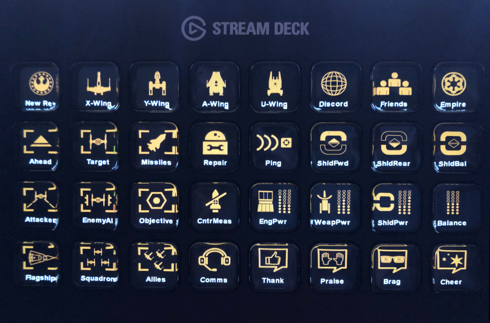
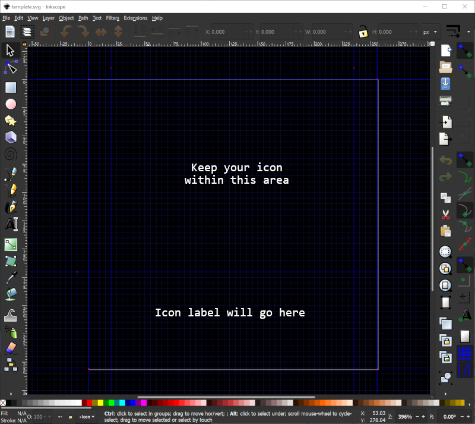

Stream Deck Star Wars Squadrons Icon Pack
=========================================

Themeable, language-neutral icons for Star Wars Squadrons and the [Elgato Stream Deck](https://www.elgato.com/en/gaming/stream-deck) programmable button box.





# Features

* The SVG-based icons in this pack are themeable, allowing you to select different colors for "normal", "active" or "alarm" states for use with hotkey switches, multi-action switches or macro toggles (using the [Bar Raider Super Macro plugin](https://github.com/BarRaider/streamdeck-supermacro)).
* Icons do not include any English text labels - rather you can use the button title functionality of the Stream Deck software to label your buttons using the terminology/language that you prefer.
* Several pre-generated icon packs are included in various themes. The automated build process allows you to easily generate new sets of custom themed icons.

# Installation

Download the latest release from the [Releases](https://github.com/Ordo-Corona-Stellarum/streamdeck-squadrons-icons/releases) page.

To use the icons, copy the icon set of your choice to your Documents folder or some other convenient location then use the Stream Deck configuration application to drag actions onto the panel layouts. To create more complex actions, consider the [Bar Raider Super Macro plugin](https://github.com/BarRaider/streamdeck-supermacro).

# Building a Custom Icon Set

To generate your own theme, you will need [ImageMagick](https://imagemagick.org/index.php) 7.0+ and the "magick" command must be in your path (e.g. `C:\Program Files\ImageMagick-7.0.10-Q16-HDRI`).

From the root of the streamdeck-squadrons-icons directory, run the built.bat file to generate a new icon set:

```
.\build.bat <theme name> <normal color> <active color> <alarm color>
```

Place each argument in quotes. Colors must be specified in a form recognized by ImageMagick. For example:

```
.\build.bat "My Theme" "#FF7F00" "#f0f0f0" "#e02020"
```

The icons will be generated into the `<theme name>` folder.

| Argument | Usage |
| --- | --- |
| **theme&nbsp;name** | Folder name where icons will be generated. This folder will be deleted before icons are re-generated. |
| **normal&nbsp;color** | Color for the "normal" state of the button. This is primary color of the theme and the only color thaty will be used by static buttons. |
| **active&nbsp;color** | Color for the "active" state of toggle and other multi-state buttons. This color should be visually distinguished from the normal color. |
| **alarm&nbsp;color** | Color for the "alarm" state of alarm buttons. This should be a bright, noticeable color. |

# Making New Icons

Icons can be created in [InkScape](https://inkscape.org/) or another SVG image editor. Use the `template.svg` file as a starting point. This template includes guides that will help properly format your icons so they will display well with label text:


